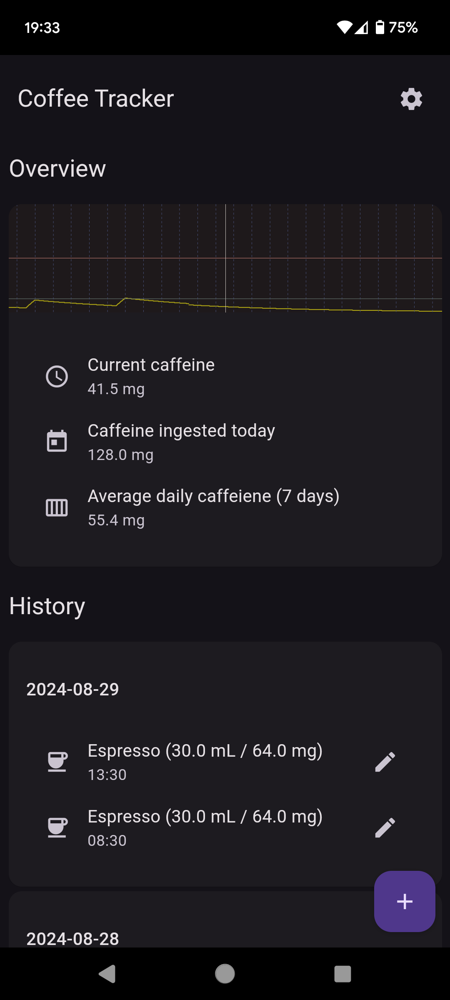

# Coffee Tracker

A simple caffeine tracker app for Android, built with Scala.js.



## Setup instructions

To run the program in a browser you will need to have yarn (or npm) installed.

Before your first run and for your tests to work, **you must** install the node dependencies with:

```sh
yarn install
```
We recommend you have two terminal tabs open:

In the first, we'll run sbt.

```sh
sbt
```

From now on, we can recompile the app with `fastLinkJS` or `fullLinkJS`.

Run `fastLinkJS` now to get an initial build in place.

Then start your dev server, with:

```sh
yarn run start
```

Now navigate to [http://localhost:1234/](http://localhost:1234/) to see your site running.

If you leave parcel's dev server running, all you have to do is another `fastLinkJS` and your app running in the browser should hot-reload the new code.

## Android Build

To run an Android build, first setup the Android environment with `npx cap add android` and `npx cap sync`.

Then, after building a dev bundle with `sbt fastLinkJS` and `yarn run start`, connect your Android device via USB and run `yarn run android`.

To update the icons and splash screen, run `yarn run generate-assets`.

## Release

To create a release build, first fill the missing fields in `capacitor.config.json`.

Then run `sbt fullLinkJS`, `yarn run sync` and open the project in android studio with `yarn run android-studio`.

Finally, on the menu choose "Build > Generate signed App Bundle / APK" and follow the instructions.
